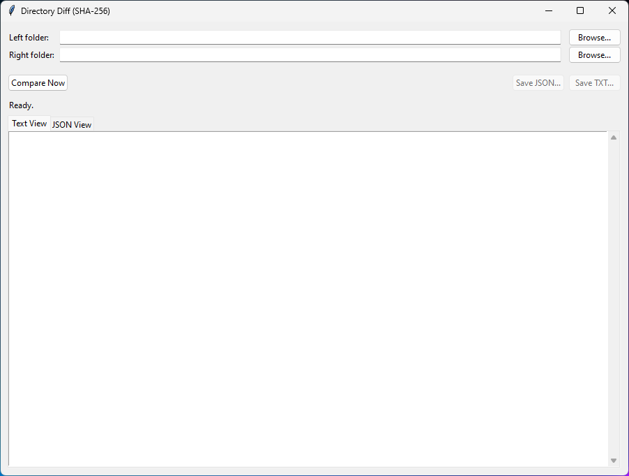
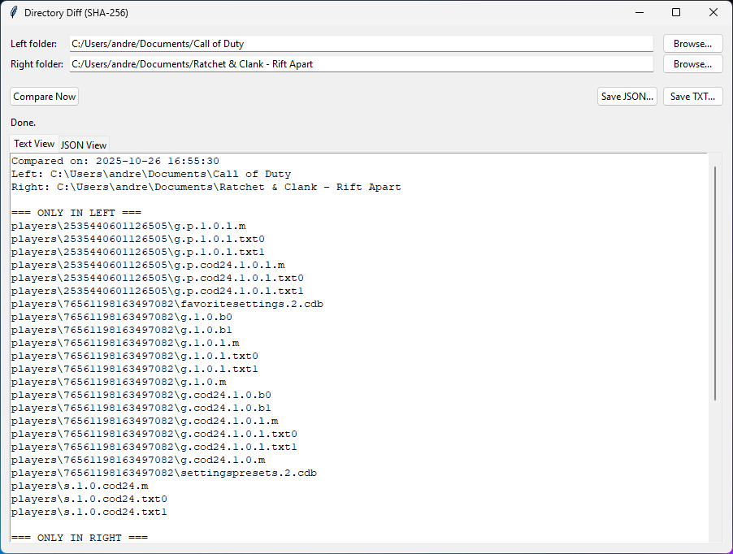
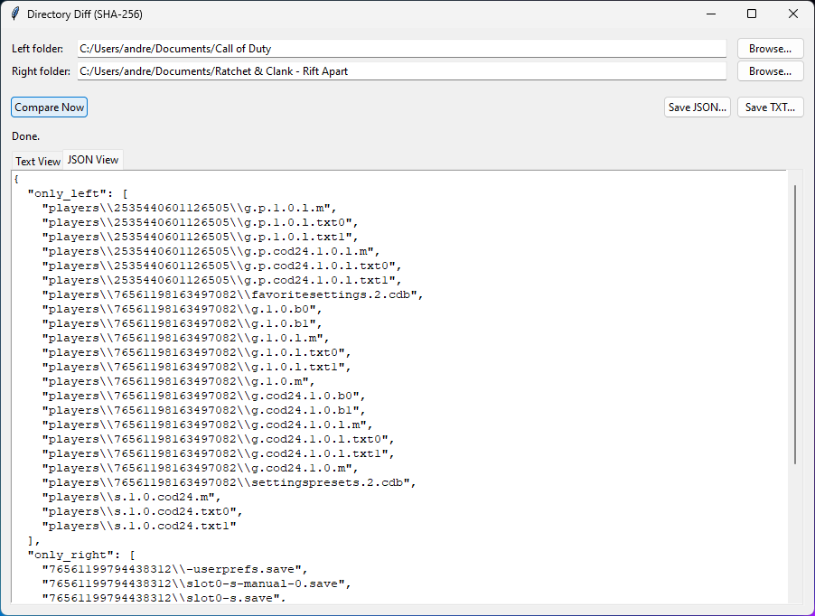

# dir-diff-gui

# Directory Diff (SHA-256) — Backup Integrity Checker for NAS Replication

A Tkinter-based GUI tool to validate that files replicated from a primary server
to a **NAS / SMB network share** are truly identical — not just present.

This is useful when:
- A scheduled backup job copies files to a NAS
- You want to verify that the NAS copy is not silently corrupted or partial
- You need a human-readable + machine-readable report (TXT/JSON)

---



## Features
- GUI — no CLI knowledge required
- Compares two folders recursively
- Detects:
  - Files only on primary
  - Files only on NAS
  - Files present on both but with different contents (via SHA-256)
  - Identical matches
- Export results to **JSON** and **TXT**
- Progress updates during hashing

---

## Screenshot



---

## How to Run

```bash
python dir_diff_gui.py
